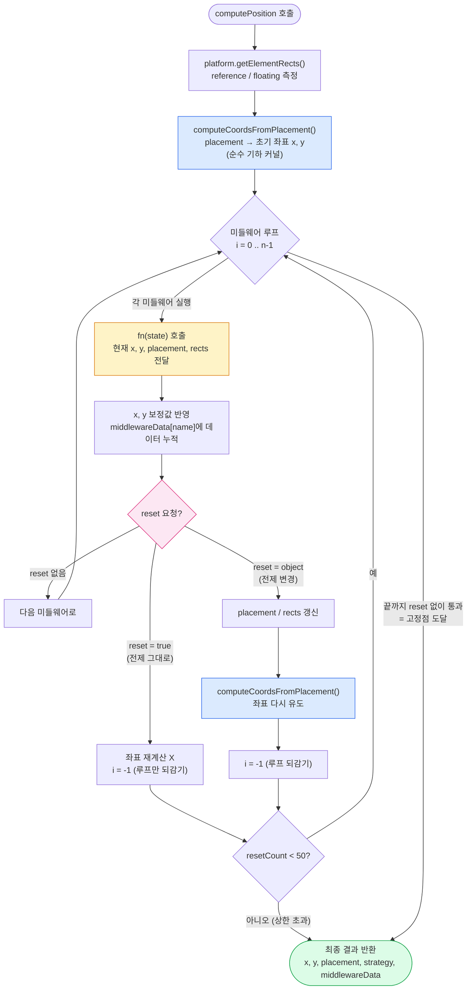

# Floating UI 깊이 읽기 — 좌표 시스템부터 computePosition 아키텍처까지

> 툴팁·드롭다운·팝오버를 "다른 요소 옆에" 놓는 일은 겉보기엔 간단하지만, 그 안에는 **두 개의 성질이 완전히 다른 문제**가 겹쳐 있습니다. 이 글은 그 둘을 분리해서, **좌표 시스템(순수 기하) → 배치 공식 → 미들웨어 수렴 루프(현실 보정) → 설계 원칙** 순서로 쌓아 올립니다.
>
> 주니어는 비유와 그림으로, 시니어는 설계 원칙과 멘탈 모델로 읽을 수 있도록 두 층으로 썼습니다.

---

## 0. 전체 흐름 한눈에 보기

먼저 숲을 보고 나무로 들어갑니다. 아래 다이어그램은 `computePosition`이 좌표를 만들어내는 전체 여정입니다.



**핵심 멘탈 모델 (이 한 문장만 기억해도 됩니다):**

> `computePosition`은 **순수 기하 계산을 시드로 삼아, 미들웨어들이 제약을 던지고, `reset`이라는 피드백으로 "아무도 더 불만이 없는 상태(고정점)"에 수렴할 때까지 도는 작은 제약 해결기**다.

이제 이 그림의 각 부분을 바닥부터 쌓아 봅니다.

---

## 1. 토대: 브라우저 좌표 시스템

모든 것은 좌표에서 시작합니다. 수학 시간의 좌표평면과 딱 하나가 다릅니다.

```
원점 (0, 0)
  ┌──────────────────────────►  X (오른쪽으로 증가)
  │
  │     ┌─────────────┐
  │     │             │
  │     │   사각형     │
  │     │             │
  │     └─────────────┘
  │
  ▼
  Y (아래로 증가)   ← 수학과 반대! Y가 아래로 갑니다
```

> 💡 **주니어 포인트:** 수학에선 Y가 위로 갔지만, 브라우저는 **왼쪽 위가 원점**이고 **Y는 아래로 갈수록 커집니다.** 책을 읽는 방향(위→아래)과 같다고 생각하면 쉽습니다.

### 사각형은 4개의 숫자다

화면의 모든 요소는 결국 사각형이고, 사각형은 **입력값 4개**로 정의됩니다.

| 입력값 | 의미 |
|---|---|
| `x` | 왼쪽 끝의 가로 위치 |
| `y` | 위쪽 끝의 세로 위치 |
| `width` | 너비 |
| `height` | 높이 |

그리고 나머지는 전부 이 4개에서 **계산되는 값(derived)**입니다.

```
left   = x
top    = y
right  = x + width
bottom = y + height
centerX = x + width / 2
centerY = y + height / 2
```

```
   x        centerX      right(x+width)
   │           │            │
   ▼           ▼            ▼
y ─┌───────────┬────────────┐
   │                        │
centerY ─ ─ ─ ─ + ─ ─ ─ ─ ─ │   ← 사각형의 정중앙
   │                        │
bottom ─└────────────────────┘
   (y+height)
```

이 단순한 사실 — **"중심 = 시작점 + 길이의 절반"** — 이 뒤에 나올 모든 배치 공식의 뿌리입니다.

---

## 2. 두 개의 사각형: Reference와 Floating

Floating UI에는 두 명의 등장인물만 있습니다.

- **Reference(기준)**: 기준이 되는 요소. 예) 사용자가 누른 버튼.
- **Floating(떠다니는)**: 기준 옆에 놓고 싶은 요소. 예) 툴팁, 드롭다운.

> 🎯 **목표:** "Floating을 Reference의 **어디에** 놓을 것인가?"를 좌표 `{x, y}`로 계산하는 것.

여기서 `{x, y}`는 항상 **Floating의 왼쪽 위 모서리**를 가리킵니다. 이걸 기억하는 게 중요합니다. 우리가 "툴팁을 위에 놓아라"라고 말할 때 머릿속엔 툴팁의 *아래쪽*이 버튼에 닿는 그림이 떠오르지만, 코드가 실제로 정하는 값은 툴팁의 *왼쪽 위 모서리*입니다. 이 간극이 나중에 "헷갈리는 지점"을 만듭니다.

---

## 3. 배치(Placement): 12가지 위치

Placement는 **4개의 변(side)** × **3개의 정렬(alignment)** 조합입니다.

- **변(side):** `top` · `right` · `bottom` · `left`
- **정렬(alignment):** `start` · (가운데) · `end`

이렇게 총 **12가지**가 나옵니다.

```
   top-start     top      top-end
        ┌─────────────────────┐
left-   │                     │   right-
start   │                     │   start
        │                     │
 left   │      REFERENCE      │   right
        │                     │
 left-  │                     │   right-
  end   │                     │     end
        └─────────────────────┘
  bottom-start   bottom   bottom-end
```

- `top` = 위쪽 + 가운데 정렬
- `top-start` = 위쪽 + 시작(왼쪽) 정렬
- `top-end` = 위쪽 + 끝(오른쪽) 정렬

> 💡 12가지를 12개의 `if`문으로 처리하면 코드가 끔찍해집니다. Floating UI는 이걸 **단 하나의 공식**으로 처리합니다. 그 비결이 다음 절의 "두 축" 추상화입니다.

---

## 4. 핵심 추상화: 두 개의 축

12가지 배치를 하나로 묶는 열쇠는, 모든 배치를 **서로 수직인 두 축**으로 분해하는 것입니다.

### Side Axis (부착 축, "Attachment Axis")
- Reference의 모서리에 **수직**인 축
- **Reference로부터 얼마나 떨어질지**를 담당
- `top`/`bottom` 배치 → **Y축** (위아래 거리)
- `left`/`right` 배치 → **X축** (좌우 거리)

### Alignment Axis (정렬 축, "Sliding Axis")
- Reference의 모서리에 **평행**한 축
- **그 모서리를 따라 어디로 미끄러질지**를 담당
- `top`/`bottom` 배치 → **X축** (좌우 정렬)
- `left`/`right` 배치 → **Y축** (위아래 정렬)

```
  top 배치의 경우:

         ◄──── Alignment Axis (X, 모서리 따라 미끄러짐) ────►
        ┌─────────────────────┐
        │      FLOATING       │
        └─────────────────────┘
                  ▲
                  │  Side Axis (Y, 떨어지는 거리)
                  ▼
        ┌─────────────────────┐
        │      REFERENCE      │
        └─────────────────────┘
```

코드로는 이렇게 표현됩니다:

```js
// 변(side)이 위/아래면 부착 축은 y, 아니면 x
function getSideAxis(placement) {
  return ['top', 'bottom'].includes(getSide(placement)) ? 'y' : 'x';
}

// 정렬 축은 부착 축의 "반대" 축
function getAlignmentAxis(placement) {
  return getOppositeAxis(getSideAxis(placement));
}
```

> 🔑 **이 추상화가 왜 강력한가:** "위/아래/왼쪽/오른쪽"이라는 4방향을 "부착 축 + 정렬 축"이라는 **2축 좌표 문제**로 바꿔버립니다. 덕분에 12가지 경우를 하나의 일반화된 계산으로 처리할 수 있습니다.

---

## 5. 좌표 계산: 가장 헷갈리는 "절반 물러서기"

이제 실제 공식입니다. `top` 배치를 예로, **세 단계**로 따라가 봅니다. (이 부분이 사람들이 가장 많이 막히는 곳입니다.)

가정: 버튼(reference)이 `x=300, width=200`. 즉 왼쪽 끝 300px, 너비 200px.

### 1단계 — Reference의 왼쪽 끝에서 시작
```
x = reference.x          // = 300
```

### 2단계 — Reference의 중심선으로 이동
```
x = reference.x + reference.width / 2     // = 300 + 100 = 400
```
버튼의 가로 중심은 400px입니다.

### 3단계 — Floating 너비의 절반만큼 되돌아오기 ⭐
```
x = reference.x + reference.width / 2 - floating.width / 2
//  = 300 + 100 - (floating.width / 2)
```

**여기가 핵심입니다.** 왜 빼야 할까요?

```
   ❌ 절반을 빼지 않으면 (x = 중심선 400):

                    400
                     │
                     ▼
                     ┌───────────────┐
                     │   FLOATING    │   ← 왼쪽 끝이 중심에 붙어
                     └───────────────┘     오른쪽으로 쏠림!
              ┌──────┴──────┐
              │  REFERENCE  │
              └─────────────┘

   ✅ 절반을 빼면 (x = 400 - floating.width/2):

              ┌───────────────┐
              │   FLOATING    │   ← 두 중심이 정확히 일치
              └───────┬───────┘
              ┌───────┴─────┐
              │  REFERENCE  │
              └─────────────┘
```

> ⭐ **기억할 문장:** Floating의 `{x}`는 **왼쪽 끝**을 정합니다. 그냥 중심선에 놓으면 Floating의 왼쪽 끝이 중심에 걸려 오른쪽으로 쏠립니다. **자기 너비의 절반만큼 왼쪽으로 물러서야** 두 중심이 맞습니다.

코드에서는 이 값을 미리 계산해 둡니다:

```js
const commonX = reference.x + reference.width / 2 - floating.width / 2;
const commonY = reference.y + reference.height / 2 - floating.height / 2;
```

- `commonX`: 가로 중앙 정렬된 x (top/bottom 배치에서 사용)
- `commonY`: 세로 중앙 정렬된 y (left/right 배치에서 사용)

### 그리고 Side Axis 방향(거리) 정하기

`top` 배치는 "Floating의 **아래쪽 끝**이 Reference의 **위쪽 끝**에 닿아야" 합니다. 하지만 우리가 정하는 건 Floating의 *위쪽 끝(y)*이죠. 그래서 Floating 높이만큼 위로 올립니다.

```
        ┌─────────────────┐ ◄── floating.y = ref.y - float.height
        │    FLOATING     │              = 100 - 60 = 40
        └─────────────────┘ ◄── floating의 아래 = 40 + 60 = 100 ✓
        ┌─────────────────┐ ◄── reference.y = 100
        │    REFERENCE    │
        └─────────────────┘
```

네 방향을 정리하면:

```js
switch (side) {
  case 'top':    coords = { x: commonX, y: reference.y - floating.height }; break;
  case 'bottom': coords = { x: commonX, y: reference.y + reference.height }; break;
  case 'right':  coords = { x: reference.x + reference.width, y: commonY };  break;
  case 'left':   coords = { x: reference.x - floating.width,  y: commonY };  break;
}
```

---

## 6. 정렬(start/end) 적용하기

가운데 정렬이 아니라 `start`/`end`라면, **정렬 축을 따라** 추가로 밀어줍니다.

```js
const alignLength = getAxisLength(alignmentAxis); // 'width' 또는 'height'
const commonAlign = reference[alignLength] / 2 - floating[alignLength] / 2;

switch (getAlignment(placement)) {
  case 'start': coords[alignmentAxis] -= commonAlign; break;
  case 'end':   coords[alignmentAxis] += commonAlign; break;
  // 가운데: 아무것도 안 함
}
```

`commonAlign`은 "두 요소의 길이 절반의 차이"입니다. `start`는 앞쪽 모서리를, `end`는 뒤쪽 모서리를 맞추기 위한 보정값이죠.

### RTL(오른쪽→왼쪽 언어) 처리 — 부호를 뒤집는 이유

아랍어·히브리어처럼 오른쪽에서 왼쪽으로 읽는 환경에서는 `start`/`end`의 **가로 방향 의미가 뒤바뀝니다.** LTR에서 `top-start`는 왼쪽 정렬이지만, RTL에서는 오른쪽 정렬이어야 하죠.

```js
const isVertical = sideAxis === 'y'; // top/bottom 배치일 때만 true

case 'start':
  coords[alignmentAxis] -= commonAlign * (rtl && isVertical ? -1 : 1);
  break;
case 'end':
  coords[alignmentAxis] += commonAlign * (rtl && isVertical ? -1 : 1);
  break;
```

**왜 `rtl && isVertical` 두 조건을 다 봐야 할까요?**

- RTL은 **가로 방향에만** 영향을 줍니다 (텍스트가 좌우로 흐를 뿐, 위아래는 그대로).
- 정렬 축이 **가로(x)가 되는 경우는 배치가 세로(top/bottom)일 때뿐**입니다.

| 배치 | 정렬 축 | RTL 영향? | 부호 뒤집기 |
|---|---|---|---|
| `top` / `bottom` | 가로(x) | ✅ 받음 | ✅ |
| `left` / `right` | 세로(y) | ❌ 무관 | ❌ |

그래서 `rtl`만으로는 부족하고 `rtl && isVertical`일 때만 뒤집습니다. 이 조건이 없으면 `left-start` 같은 가로 배치의 세로 정렬까지 잘못 뒤집히게 됩니다.

> 여기까지가 **"순수 기하 커널"**(`computeCoordsFromPlacement`)의 전부입니다. 입력(placement, rects, rtl)이 같으면 출력(x, y)도 항상 같은, 부수효과 없는 깨끗한 함수입니다.

---

## 7. 근본 문제: 포지셔닝은 "순수 기하학"이 아니다

여기서부터가 이 글의 진짜 주제입니다. **무엇을** 하는지가 아니라, **왜 이렇게** 설계했는가.

5~6절에서 본 좌표 계산은 아름답습니다. 입력이 같으면 출력이 같고, 부수효과가 없고, 머릿속으로 따라갈 수 있습니다. 만약 세상이 이게 전부라면 `computePosition`은 그냥 `computeCoordsFromPlacement` 한 줄이면 끝났을 겁니다.

하지만 실제로 툴팁을 띄워보면 현실이 끼어듭니다.

```
   ❌ 순수 계산만 했을 때:

   ┌─────────────────────────── 화면(viewport) ───┐
   │                                              │
   │                              ┌──────────┐    │
   │                              │ REFERENCE│    │
   │                              └──────────┘    │
   │                                   ┌──────────┼──── 잘림!
   │                                   │ FLOATING │ ▒▒▒
   └───────────────────────────────────┴──────────┘▒▒▒
```

그래서 보정이 필요합니다:

- 화면 밖으로 잘리면 → 반대편으로 **뒤집기**(flip)
- 그래도 넘치면 → 안쪽으로 **밀기**(shift)
- 공간에 맞춰 → 크기 **줄이기**(size)
- 화살표를 가운데 → **맞추기**(arrow)
- ...그리고 **라이브러리가 상상도 못 한** 사용자만의 요구

### 두 개의 문제는 본질적으로 성질이 다르다

핵심 통찰은 이것입니다. 포지셔닝 안에는 **성질이 정반대인 두 종류의 문제**가 섞여 있습니다.

| | (A) 순수 기하 계산 | (B) 현실 보정 |
|---|---|---|
| 성질 | 닫혀 있음(closed) | **개방적(open-ended)** |
| 종류 | 12개 배치로 고정 | 끝없이 늘어남 |
| 결정성 | 입력=출력, 항상 같음 | 런타임 측정값에 의존 |
| 상호작용 | 독립적 | **서로의 전제를 무너뜨림** |
| 비유 | 수학 공식 | 협상·타협 |

(A)는 **수학**입니다. "bottom에 놓아라"는 답이 하나로 정해집니다.
(B)는 **협상**입니다. flip은 "위로 가자"고 하고, shift는 "왼쪽으로 밀자"고 하고, 둘은 서로 영향을 주며 타협점을 찾아야 합니다.

### 가장 큰 함정: 둘을 섞는 것

순진한 구현은 이 둘을 한 함수에 욱여넣습니다.

```js
// ❌ 안티패턴: 순수 계산과 현실 보정을 한 덩어리로
function computePosition(ref, float, placement) {
  let coords = computeBase(ref, float, placement); // (A) 순수

  // (B) 보정들을 여기 직접 박는다
  coords = applyFlip(coords, ...);   // 화면 넘치면 뒤집고
  coords = applyShift(coords, ...);  // 또 넘치면 밀고
  coords = applyArrow(coords, ...);  // 화살표 맞추고
  // flip이 placement를 바꿨는데... applyShift는 옛 placement 기준이네? 😱
  return coords;
}
```

이 코드는 **세 가지 이유로 무너집니다.** 그리고 이 세 가지가 곧 뒤에 나올 세 가지 설계 결정의 *이유*입니다.

1. **(B)가 개방적인데 코드에 박아버렸다** → 새 보정이 생길 때마다 이 함수를 수정해야 하고, 사용자는 자기 보정을 끼워 넣을 수 없으며, 안 쓰는 보정까지 번들에 들어갑니다.
   → **그래서 미들웨어(8절)가 필요합니다.**

2. **(B)끼리 서로의 전제를 무너뜨리는데 단방향으로 흐른다** → flip이 placement를 바꾸면 그 위에서 계산한 applyShift는 거짓말이 됩니다. 한 번 흘러간 계산을 되돌릴 방법이 없습니다.
   → **그래서 reset 재진입 루프(9절)가 필요합니다.**

3. **(A)가 측정값(`ref`, `float`의 실제 크기)에 의존하는데 그 측정을 누가 하나** → DOM에서 직접 재면 브라우저에 묶입니다.
   → **그래서 플랫폼 추상화(10절)가 필요합니다.**

> 💡 **이 글 전체를 관통하는 한 문장:**
> Floating UI의 설계는 결국 **"닫힌 수학(A)을 더럽히지 않으면서, 개방적이고 서로 충돌하는 협상(B)을 안전하게 수렴시킨다"**는 한 가지 목표를, 세 개의 분리로 풀어낸 것입니다.

다음 세 절은 각각 위 1·2·3번 문제를 **어떤 대안들을 제치고 왜 지금 방식으로** 풀었는지를 다룹니다.

---

## 8. 미들웨어 파이프라인: 개방성을 다루는 법 (문제 ①)

> **풀어야 할 문제:** (B) 보정은 개방적이다. 종류를 미리 다 알 수 없다.

### 거부된 대안들

이 문제를 푸는 길은 여럿이었고, 왜 다른 길을 버렸는지를 보면 미들웨어가 왜 "필연"인지 드러납니다.

**대안 A — core에 모두 박기 (`if`/`switch` 나열)**
```js
coords = applyFlip(coords);
coords = applyShift(coords);
// ...
```
- ❌ 새 보정마다 core 수정 → **OCP 위반**
- ❌ 사용자가 자기 보정을 끼워 넣을 방법이 없음
- ❌ flip만 쓰는 사람도 shift·size·arrow 코드를 전부 번들에 받음
- → 닫힌 문제에는 맞지만, (B)는 **열린 문제**라 근본적으로 안 맞음

**대안 B — 상속 계층 (`class FlipPositioner extends BasePositioner`)**
- ❌ 보정의 조합·순서가 런타임에 동적인데, 상속은 컴파일타임에 고정됨
- ❌ "flip + shift는 쓰고 arrow는 빼고, 순서는 거꾸로" 같은 조합 폭발을 클래스 트리로 표현 불가
- → 경직성 때문에 탈락

**대안 C (채택) — 보정을 데이터로 외부 주입 (미들웨어 배열)**
- ✅ core는 배열 내용을 모름 → 추가해도 core 불변(OCP)
- ✅ 사용자가 순서·구성을 자유롭게 조합(합성)
- ✅ 쓰는 것만 import → 트리셰이킹

### 그래서: 보정을 core에 박지 말고, 외부에서 배열로 주입받는다

```js
computePosition(reference, floating, {
  placement: 'bottom',
  middleware: [flip(), shift(), arrow(), myCustomMiddleware()], // 열린 목록
});
```

`computePosition`은 이 배열에 **뭐가 들었는지 모릅니다.** 그냥 순서대로 실행할 뿐이죠.

```js
for (let i = 0; i < middleware.length; i++) {
  const { name, fn } = middleware[i];

  // 미들웨어에게 "현재 상태"를 주고, "변경 제안"을 돌려받는다
  const { x: nextX, y: nextY, data, reset } = await fn({
    x, y, placement: statefulPlacement, rects, middlewareData, /* ... */
  });

  x = nextX ?? x;
  y = nextY ?? y;
  middlewareData[name] = { ...middlewareData[name], ...data };

  // reset 처리는 다음 절에서
}
```

각 미들웨어는 **한 가지 일만** 하고, **서로를 직접 호출하지 않습니다.** 정보 공유가 필요하면 `middlewareData`라는 **공유 데이터 버스**에 써두고 읽습니다. (arrow가 계산한 값을 렌더링이 읽고, flip이 "어디까지 시도했는지" 기억하는 식입니다.)

> 💡 **비유:** 미들웨어는 요리의 검수 담당자들입니다. 한 명은 간만, 한 명은 온도만, 한 명은 플레이팅만 봅니다. 서로 대화하지 않고, 각자 메모지(`middlewareData`)에 결과만 적어둡니다.

---

## 9. `reset`: 충돌을 다루는 피드백 루프 (문제 ②, 이 파일의 정수)

> **풀어야 할 문제:** (B) 보정끼리 서로의 전제를 무너뜨린다.

### 왜 한 번 통과로는 안 되나

미들웨어를 한 번 죽 통과시키면 될 것 같지만, 5번째 미들웨어(flip)가 placement를 `bottom`→`top`으로 바꾸는 순간, 1~4번째가 `bottom`을 전제로 한 계산이 전부 무효가 됩니다. 단방향 파이프라인으로는 과거를 되돌릴 수 없습니다. 이건 단순한 변환 체인이 아니라 **피드백이 있는 시스템**입니다.

### 거부된 대안들

이 "피드백" 문제야말로 이 라이브러리에서 가장 깊은 설계 결정이 일어난 지점입니다.

**대안 A — 미들웨어가 placement를 직접 변이(mutate)**
```js
function flip(state) {
  if (overflows) state.placement = 'top'; // 직접 바꿔버림
}
```
- ❌ 누가 언제 무엇을 바꿨는지 추적 불가 → 디버깅 지옥
- ❌ 앞 미들웨어가 만든 좌표와 즉시 불일치 (placement는 top인데 x,y는 bottom 기준)
- ❌ "다시 계산해야 한다"는 사실을 시스템이 알 방법이 없음
- → 명령형 변이는 일관성을 보장할 수 없어 탈락

**대안 B — 의존성 그래프를 미리 풀어 위상정렬**
- "flip은 shift보다 먼저, shift는 arrow에 의존..." 식으로 정적으로 순서를 풀려는 시도
- ❌ 보정 간 의존은 **런타임 측정값에 따라 동적으로** 생깁니다. "이번엔 flip이 일어났으니 shift를 다시" vs "이번엔 flip이 안 일어남"이 매 실행 달라짐
- ❌ 정적 그래프로는 "측정해 보기 전엔 모르는" 의존을 표현할 수 없음
- → 동적 의존성 때문에 탈락

**대안 C (채택) — 선언형 reset 신호 + 재진입 루프**
- 미들웨어는 변이하지 않고, "내가 전제를 바꿨다"는 **의도만 선언**(`return { reset }`)
- 흐름의 제어권은 오케스트레이터가 가짐 → **제어의 역전(IoC)**
- 명령형 피드백을 **통제된 고정점 반복(fixed-point iteration)**으로 바꿔버림
- ✅ 추적 가능(모든 변경이 reset이라는 한 통로를 지남)
- ✅ 일관성 보장(전제가 바뀌면 좌표를 반드시 순수 커널로 다시 유도)
- ✅ 동적 의존성을 "안정될 때까지 반복"으로 자연스럽게 흡수

> 🔑 **핵심 전환:** "보정끼리 서로 영향을 준다"는 풀기 어려운 그래프 문제를, **"아무도 더 불만 없을 때까지 처음부터 다시 돌린다"는 수렴 문제**로 바꾼 것. 이게 reset 설계의 본질입니다.

### 해결책: "안정될 때까지 처음부터 다시"

미들웨어가 "내가 전제를 바꿨어"라고 **선언(reset)**하면, 오케스트레이터가 루프를 처음으로 되감습니다.

```js
if (reset && resetCount < MAX_RESET_COUNT) {
  resetCount++;

  if (typeof reset === 'object') {
    if (reset.placement) {
      statefulPlacement = reset.placement;        // placement 갱신
    }
    if (reset.rects) {
      rects = reset.rects === true
        ? await platform.getElementRects({ reference, floating, strategy }) // 재측정
        : reset.rects;                            // 직접 준 값 사용
    }
    // 전제가 바뀌었으니 좌표를 순수 커널로 다시 유도
    ({ x, y } = computeCoordsFromPlacement(rects, statefulPlacement, rtl));
  }

  i = -1; // 루프를 처음으로 되감기 (다음 i++로 0이 됨)
}
```

### `reset`의 3가지 모양 — 의미로 구분

경계는 단 하나입니다: **"순수 커널의 전제(placement/rects)를 건드렸는가?"**

| `reset` 값 | 의미 | 좌표 재계산? | 루프 재실행? |
|---|---|:---:|:---:|
| `true` | "전제는 그대로. 출력 좌표만 살짝 건드렸으니 뒤 미들웨어가 다시 보게만 해줘" | ❌ | ✅ |
| `{ placement }` | "placement가 바뀌었다" (전제 변경) | ✅ | ✅ |
| `{ rects: true }` | "rect가 바뀌었는데 새 값을 내가 모른다 → 플랫폼이 재측정해라" | ✅ | ✅ |
| `{ rects: 객체 }` | "rect가 바뀌었고 내가 이미 측정했다 → 이 값 써라(재측정 생략)" | ✅ | ✅ |

두 가지 설계 결정이 여기 숨어 있습니다:

1. **`true`가 좌표를 재계산하지 않는 이유:** 전제가 안 바뀌었으니 커널을 다시 돌려도 결과가 같고, 오히려 미들웨어가 더해둔 보정(예: arrow의 offset)만 날아갑니다. 그래서 좌표 재계산을 **건너뛰고** 루프만 되감습니다.

2. **`rects === true` vs `객체`를 엄격 비교로 가르는 이유:** DOM 측정은 비싼 작업입니다. 이미 측정값을 손에 쥔 미들웨어는 객체를 넘겨 **중복 측정을 피하고(성능 최적화)**, 모르는 미들웨어는 `true`로 플랫폼에 위임합니다. 단순 truthy 체크였다면 이 둘을 구분할 수 없었겠죠.

### 이 루프의 정체: 제약 해결기(fixed-point solver)

> 🔑 for 루프는 "한 번 통과"가 아니라 **"아무도 더 이상 reset을 요청하지 않는 안정 상태(고정점)에 도달할 때까지 반복"**하는 수렴 루프입니다. `reset`은 그 피드백 간선이고요.

### 안전장치: `MAX_RESET_COUNT = 50`

서로 충돌하는 보정은 진동할 수 있고(flip ↔ shift가 서로를 무한히 유발), 수렴이 수학적으로 보장되지 않습니다. 그래서 상한선을 둬 **"완벽한 해를 못 찾아도 최소한 멈추긴 한다"**를 보장합니다. 이상보다 안전을 택한 현실적 엔지니어링 결정입니다.

---

## 10. 플랫폼 추상화: 환경 독립성 (문제 ③)

> **풀어야 할 문제:** (A) 순수 계산은 실제 크기·위치(측정값)에 의존하는데, 측정 방법은 환경마다 다르다.

`computePosition`은 좌표 계산에 필요한 **측정**을 직접 하지 않습니다.

```js
const rtl   = await platform.isRTL?.(floating);
let   rects = await platform.getElementRects({ reference, floating, strategy });
```

### 왜 측정을 직접 하지 않았나

순진하게 짠다면 core가 그냥 `element.getBoundingClientRect()`를 부르면 됩니다. 하지만 그 한 줄이 core를 **영원히 브라우저에 묶어버립니다.**

- React Native에는 `getBoundingClientRect`가 없습니다 (측정 방식이 완전히 다름)
- 테스트에서 좌표를 통제하려면 실제 DOM을 띄워야 합니다 (느리고 깨지기 쉬움)
- 캔버스·서버 환경에선 아예 동작 불가

그래서 의존성 방향을 **역전**시켰습니다(DIP). core는 측정 *방법*을 모른 채, "측정해 줘"라고 주입받은 `platform`에게 **요청만** 합니다. 실제 구현(`getBoundingClientRect` 호출)은 `@floating-ui/dom`이, RN 측정은 `@floating-ui/react-native`가, 테스트에선 mock이 끼워 넣습니다.

```
        (의존 방향이 뒤집힘)

  core ──depends on──► [Platform 인터페이스]
                              ▲   ▲   ▲
              implements ─────┘   │   └───── implements
                  dom            mock          react-native
```

이 덕분에 `@floating-ui/core`는 **브라우저라는 단어를 단 한 번도 모른 채** 존재할 수 있습니다. (A)의 순수함이 환경 종속이라는 오염으로부터 보호되는 거죠 — 문제 ③의 해결입니다.

---

## 11. 설계 원칙과의 연결

이 작은 파일은 SOLID + 고전 패턴의 교과서입니다.

| 원칙 | 이 코드에서 | 한 줄 요약 |
|---|---|---|
| **OCP** (개방-폐쇄) | 미들웨어 배열 | 보정을 **추가**해도 core는 **수정** 안 함 |
| **SRP** (단일 책임) | 커널 / 플랫폼 / 미들웨어 / 오케스트레이터 분리 | 각자 변경 이유가 하나 |
| **DIP** (의존성 역전) | `platform` 주입 | core가 DOM이 아닌 인터페이스에 의존 |
| **LSP** (리스코프 치환) | 계약만 맞으면 어떤 platform/미들웨어든 동작 | 구현을 자유롭게 갈아끼움 |
| **ISP** (인터페이스 분리) | optional 메서드/필드 (`isRTL?`, `reset?`) | 안 쓰는 기능 구현 강요 안 함 |
| **Functional Core / Imperative Shell** | 순수 커널 + 지저분한 async 껍질 | 더러움을 얇은 바깥층에 가둠 |
| **IoC / 선언형** | `reset` 신호 | 미들웨어는 "의도"만, 흐름은 오케스트레이터가 |
| **Mediator (데이터 버스)** | `middlewareData` | 미들웨어끼리 직접 참조 안 함 → 낮은 결합도 |
| **합성 > 상속** | 미들웨어 배열 조합 | 경직된 클래스 트리 대신 유연한 조합 |

### 가장 중요한 통찰

이 원칙들은 따로 적용된 게 아니라, **하나의 문제에서 연쇄적으로 도출**됩니다.

```
보정이 개방적 → OCP(확장점 필요) → 미들웨어
  → 교체·주입 가능하게 → Strategy + DIP + 합성
    → 각자 독립적이려면 → SRP, 서로 안 부르려면 → Mediator(데이터 버스)
      → 그런데 보정끼리 전제를 무너뜨림 → 단방향 불가 → 선언형 reset + IoC(수렴 루프)
        → 환경 독립 → DIP + ISP로 platform 추상화
          → 부품을 계약만으로 갈아끼우려면 → LSP
```

> **좋은 아키텍처는 원칙을 "적용"한 결과가 아니라, 문제를 정직하게 풀다 보면 원칙들이 자연히 "수렴"해 나타난다.** computePosition이 그 좋은 예입니다.

---

## 12. 한 문단 요약 (누구에게나)

`computePosition`은 **순수한 기하 계산을 시드로 삼아, 미들웨어들이 제약을 던지고, `reset`이라는 피드백으로 안정 상태에 수렴할 때까지 도는 작은 제약 해결기**입니다. 핵심은 "깨끗한 핵심(좌표 기하)"과 "지저분한 현실(보정)"을 철저히 분리하고, 보정을 외부에서 끼워 넣을 수 있게(개방성) 만든 뒤, 보정끼리 서로의 전제를 무너뜨리는 문제를 "처음부터 다시 돌리는 수렴 루프"로 해결한 것입니다.

- **주니어**는 이렇게 기억하세요: *"좌표는 두 중심을 맞추는 일(절반 물러서기)이고, 주방장(computePosition)은 검수자들(미들웨어)이 모두 만족할 때까지 요리를 다시 만든다."*
- **시니어**는 이렇게 읽으세요: *"순수 커널 + 플랫폼 추상화(DIP) + 선언형 reset 기반 고정점 반복(IoC) + 데이터 버스로 디커플링된 플러그인 파이프라인(OCP)."*

---

## 부록: 12가지 배치 좌표 공식 빠른 참조

(`ref` = reference, `float` = floating, `w` = width, `h` = height)

| Placement | x 공식 | y 공식 |
|---|---|---|
| `top` | `ref.x + ref.w/2 - float.w/2` | `ref.y - float.h` |
| `top-start` | `ref.x` | `ref.y - float.h` |
| `top-end` | `ref.x + ref.w - float.w` | `ref.y - float.h` |
| `bottom` | `ref.x + ref.w/2 - float.w/2` | `ref.y + ref.h` |
| `bottom-start` | `ref.x` | `ref.y + ref.h` |
| `bottom-end` | `ref.x + ref.w - float.w` | `ref.y + ref.h` |
| `left` | `ref.x - float.w` | `ref.y + ref.h/2 - float.h/2` |
| `left-start` | `ref.x - float.w` | `ref.y` |
| `left-end` | `ref.x - float.w` | `ref.y + ref.h - float.h` |
| `right` | `ref.x + ref.w` | `ref.y + ref.h/2 - float.h/2` |
| `right-start` | `ref.x + ref.w` | `ref.y` |
| `right-end` | `ref.x + ref.w` | `ref.y + ref.h - float.h` |

> ⚠️ 위 `-start`/`-end` 공식은 LTR 기준입니다. RTL이면서 세로 배치(top/bottom)일 때는 start/end의 가로 방향이 뒤집힙니다 (6절 참고).

---

## 참고 자료

- 소스: `packages/core/src/computePosition.ts`, `packages/core/src/computeCoordsFromPlacement.ts`
- Jinghuang Su, "Floating UI — Coordinate System" — https://www.jinghuangsu.com/til/floating-ui-coordinate-system
- Jinghuang Su, "Floating UI — useFloating" — https://www.jinghuangsu.com/til/floating-ui-use-floating
