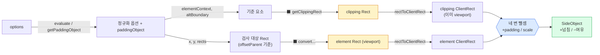

# Floating UI 깊이 읽기 — detectOverflow: 충돌 감지의 토대

> 좌표 시스템(`computeCoordsFromPlacement`)이 "이상적인 위치"를 구한다면, `detectOverflow`는 **"그 위치가 현실에서 잘리는가?"**를 측정합니다. flip·shift·size·hide·autoPlacement 같은 충돌 보정 미들웨어가 **전부 이 함수 하나에 의존**합니다.
>
> 이 글은 `ClientRect`, `clipping`, `padding`, `platform interface`를 **하나도 모른다는 전제**로 씁니다. **0절(멘탈 모델)이 가장 중요합니다.** 0절만 읽어도 "이 함수가 무엇을·왜 하는지"가 완성되고, 1절부터는 그 한 문장을 푸는 각주입니다.

---

## 0. 한눈에 — 문제 → 해결 → 멘탈 모델 ⭐

> 이 절이 문서의 심장입니다. 나머지 절은 전부 여기 나온 단어("사각형", "방", "빼기", "같은 잣대")를 하나씩 푸는 것입니다.

### 어떤 문제인가

툴팁(floating)을 버튼(reference) 위에 놓았는데, 버튼이 화면 맨 위에 있으면 툴팁이 화면 밖으로 삐져나가 잘립니다.

```
   ┌──────────────── 화면(viewport) ────────────────┐
   │  ▒▒▒▒▒▒▒▒▒▒▒▒▒▒▒▒▒▒▒▒▒▒▒▒▒▒▒▒▒  ← 툴팁 윗부분이 잘림 │
   │           ┌──────────────┐                      │
   │           │   TOOLTIP    │                      │
   │           └──────────────┘                      │
   │           ┌──────────────┐                      │
   │           │    BUTTON    │                      │
   │           └──────────────┘                      │
   └─────────────────────────────────────────────────┘
```

flip 미들웨어가 "툴팁을 버튼 아래로 뒤집자"고 판단하려면, 먼저 **"지금 위로 얼마나 잘렸는가?"**를 *숫자로* 알아야 합니다. 그 숫자를 만드는 게 detectOverflow입니다.

### 어떻게 해결하나

두 사각형을 비교합니다.

```
   ┌─────────────────────────────────────────────┐
   │  "방"  = 가둬두는 영역 (clipping rect)          │
   │                                              │
   │         ┌──────────────────┐                 │
   │         │  "가구" = 검사 대상  │                 │
   │         │  (element rect)   │                 │
   │         └──────────────────┘                 │
   └─────────────────────────────────────────────┘
```

**"방의 네 벽"과 "가구의 네 변" 사이 거리를 빼서**, 각 방향으로 얼마나 넘쳤는지를 숫자 4개로 냅니다. 단, 빼기 전에 **두 사각형을 같은 잣대(좌표계)로 맞추는** 게 전제입니다.

### 출력 미리보기 (이 함수가 만드는 것)

```ts
{ top: 28, right: -50, bottom: -300, left: -50 }
//   ^^^ 양수 = 그 방향으로 28px 넘침      음수 = 아직 여유
```

부호 규약 한 줄: **`+` = 넘침, `−` = 여유, `0` = 딱 맞음.**

### 멘탈 모델 (한 문장)

> `detectOverflow`는 **스스로 무언가를 고치지 않고, "방(clipping)"과 "가구(element)"라는 두 사각형을 같은 좌표계로 맞춘 뒤 네 변의 거리를 빼서 '넘친 양'을 부호 있는 숫자 4개로 돌려주는 '센서'**다.

이 센서의 출력을 받아서 flip은 뒤집고, shift는 밀고, size는 줄이고, hide는 숨깁니다. detectOverflow 자신은 **측정만** 합니다.

```
   detectOverflow (센서)  ──→  { top, right, bottom, left }
                                      │
              ┌───────────────┬───────┴───────┬──────────────┐
            flip            shift            size           hide
          (뒤집기)          (밀기)           (줄이기)         (숨기기)
```

> 이제 0절의 네 단어를 하나씩 풉니다: **사각형(1절) · 방(2절) · 빼기와 부호(3절) · 같은 잣대(4절)**, 그리고 변주(5절)와 조립(6절).

---

## 1. 재료: `Rect` vs `ClientRect`

> 0절의 "사각형"을 푼다. 비교의 *재료*.

화면의 모든 요소(버튼·툴팁·스크롤 박스·화면 자체)는 사각형입니다. detectOverflow는 사각형 둘을 비교하므로, 사각형 표현부터 알아야 합니다. 두 가지 형태를 오갑니다.

### 형태 A — `Rect`: "위치 + 크기"

```ts
{ x, y, width, height }
```
```
  (x, y) = 왼쪽 위 모서리
    ●───────────────┐
    │               │ height
    │     RECT      │
    └───────────────┘
         width
```
"어디서 시작해 얼마나 큰가." 위치를 잡기 자연스러워 **좌표 계산**에서 주로 씀.

### 형태 B — `ClientRect`: "네 변이 각각 어디 있나"

```ts
{ top, right, bottom, left, x, y, width, height }
```
```
   left              right
   ▼                  ▼
top─┌──────────────────┐
    │    CLIENTRECT    │
bottom─└────────────────┘
```
**네 변의 좌표를 직접** 담음. 브라우저 `getBoundingClientRect()`와 같은 모양이라 "Client**Rect**".

### 변환 — `rectToClientRect`

```ts
top = y    left = x    right = x + width    bottom = y + height
```

### 💡 왜 ClientRect로 바꾸나

detectOverflow의 핵심은 **"두 사각형의 *같은 변*끼리 거리 재기"**입니다. "방의 위 벽(top) vs 가구의 위 변(top)"을 비교하려면 변의 좌표(`top/right/bottom/left`)가 바로 있어야 편합니다. 그래서 비교 직전 두 사각형을 모두 ClientRect로 변환합니다.

### 좌표계 복습 (중요)

```
원점(0,0)=화면 왼쪽 위.  X→오른쪽 증가,  Y↓아래로 증가 (수학과 반대!)
```
Y가 아래로 커지므로 "위 변(top) 값이 작을수록 위에 있다" — 3절 부호 계산의 근거.

---

## 2. 기준: `clipping` (가둬두는 영역)

> 0절의 "방"을 푼다. 비교의 *기준*.

"넘쳤다"고 하려면 **무엇에 대해** 넘쳤는지 경계가 필요합니다. 그게 **clipping boundary(클리핑 경계)**.

### 클리핑 = "자식을 잘라내는 능력"

`overflow: hidden` / `overflow: scroll`인 요소는 자기 영역을 벗어난 자식을 **잘라냅니다**.

```
   ┌──── 스크롤 컨테이너 (overflow: scroll) ────┐
   │   ┌──────────────┐                       │
   │   │  보이는 자식   │                       │
   │   └──────────────┘                       │
   └──────────────────────────────────────────┘
        ┊ ┌──────────────┐ ┊
        ┊ │  잘린 자식    │ ┊  ← 컨테이너 밖이라 안 보임
        ┊ └──────────────┘ ┊
```

### clipping ancestors — 잘라내는 부모들의 사슬

한 요소가 보이려면 **위의 모든 "잘라내는 조상"을 다 통과**해야 하고, 최종은 **화면(viewport)**입니다.

```
   <html> (viewport)  ← 최종 경계 = rootBoundary
     └─ <div overflow:hidden>        ← 잘라냄 ①
          └─ <div overflow:scroll>   ← 잘라냄 ②
               └─ [FLOATING]

   가둬두는 영역 = { ①, ②, viewport }의 교집합 (가장 빡빡한 공통 영역)
```

> 💡 `getClippingRect`가 이 사슬을 따라 "교집합 영역"을 사각형 하나로 계산합니다. 우리(core)는 *어떻게*는 몰라도 되고, "방 사각형 하나를 받는다"만 알면 됩니다.

### 옵션으로 경계 조절
- `boundary: 'clippingAncestors'`(기본) → 스크롤 조상 자동 탐색
- `rootBoundary: 'viewport'`(기본) / `'document'` / 직접 준 `Rect`

> 🏠 **비유:** 방 안에 가구를 둘 때, 문밖으로 삐졌는지 재려면 "방의 네 벽"이 기준. 방이 또 다른 방 안이면 한계는 "겹치는 가장 좁은 벽".

---

## 3. 비교의 본체: 핵심 공식 + 부호 규약

> 0절의 "빼서 넘침을 낸다"를 푼다. 이 함수가 직접 하는 유일한 일.

### 네 변 동시에 보기

```
                    ↑ top
   ┌────────────────┼────────────────────────────┐  ← clipping (방)
   │       ┌────────┴─────────┐                   │
   │ left  │                  │  right            │
   │ ◄───► │  element (가구)   │ ◄─────────────►   │
   │       └────────┬─────────┘                   │
   └────────────────┼────────────────────────────┘
                    ↓ bottom

   각 화살표 = "그 방향에서 벽과 가구 가장자리 사이 거리"
   가구가 벽 안 → 음수(여유) / 벽을 넘음 → 양수(넘침)
```

### 변별 공식 (padding·scale은 4절)

```
top    = clipping.top    − element.top
bottom = element.bottom  − clipping.bottom
left   = clipping.left   − element.left
right  = element.right   − clipping.right
```

### 왜 top/left와 bottom/right의 방향이 다른가

규칙은 하나: **"바깥쪽 가장자리 − 안쪽 가장자리"**가 되도록. 그래야 넘치면 +.

```
   위쪽: clipping이 바깥(아래=큰 값), element가 안쪽
        element.top=30 ┌──────────┐  ← 벽보다 20 위로 삐짐
        clipping.top=50 ──────────── ← 위 벽
        top = 50 − 30 = +20  "위로 20 넘침" ✓

   아래쪽: element가 바깥(아래=큰 값), clipping이 안쪽
        clipping.bottom=100 ──────── ← 아래 벽
        element.bottom=120 └────────  ← 벽보다 20 아래로 삐짐
        bottom = 120 − 100 = +20  "아래로 20 넘침" ✓
```

> 🔑 항상 *"바깥 가장자리 − 안쪽 가장자리"*. 위/왼쪽은 clipping이 바깥, 아래/오른쪽은 element가 바깥 기준이라 방향이 갈림. 결과는 언제나 "넘치면 +".

### 부호 규약 = 출력의 언어 (공용 프로토콜)

```
   −∞ ◄──────────────── 0 ────────────────► +∞
       여유 많음        딱 맞음        많이 넘침
      (안전)          (경계선)        (위험)
```

| 값 | 의미 | 미들웨어 반응 |
|---|---|---|
| **+** | 그 방향으로 **넘침**(px) | flip 뒤집기 / shift 밀기 |
| **−** | 아직 **여유**(남은 px) | 아무것도 안 함 |
| **0** | 경계에 **딱 붙음** | 경계선 |

> 💡 이 단일 규약 덕분에 미들웨어는 detectOverflow 내부를 몰라도 `if (overflow.top > 0)` 한 줄로 "위로 넘쳤네"를 압니다. **공용 프로토콜**이 부품들을 디커플링합니다. 반환 타입 이름이 `SideObject`(= 네 변 객체)입니다.

---

## 4. 전제조건: 같은 잣대로 맞추기 (convert & scale)

> 0절의 "같은 좌표계로 맞춘 뒤"를 푼다. 뺄셈이 의미를 가지려면 두 사각형이 같은 잣대여야 함.

"내 방 기준 cm"와 "지도 기준 km"를 빼면 무의미합니다. 그래서 빼기 전에 정렬합니다. 그런데 정렬은 **비대칭** — clipping은 그대로, element만 변환합니다.

```
   clipping rect:  getClippingRect → 이미 viewport 기준 (변환 불필요)
   element rect:   state.{x, y}    → offsetParent 기준 (변환 필요!)
                        │ ⬛ convertOffsetParentRelativeRectToViewportRelativeRect
                        ▼
                   viewport 기준  ← 이제 clipping과 같은 잣대
```

### ⚠️ 헷갈리는 점 1: "경계의 종류" ≠ "좌표계"

"clipping이 viewport가 아닐 수도 있지 않나?" — 두 질문을 분리하세요.

| 질문 | 답 |
|---|---|
| 경계(방)가 **viewport가 아닐 수 있나?** | ✅ 네 (스크롤 div, document, 커스텀 Rect) |
| 그 경계의 **좌표계가 viewport가 아닐 수 있나?** | ❌ 아니요 — 항상 viewport로 표현 |

**"방이 무엇인가"는 바뀌어도, "방을 재는 자(좌표계)"는 항상 viewport로 고정.** dom 구현이 보장합니다 — 경계가 스크롤 div여도 내부적으로 `getBoundingClientRect()`(본질적 viewport 기준)로 잽니다. 그래서 clipping은 변환이 *필요 없는 게 아니라, 이미 viewport 기준*입니다.

### ⚠️ 헷갈리는 점 2: floating의 원점은 reference가 아니라 **offsetParent** (깊이 보기)

이 부분이 detectOverflow에서 가장 헷갈리면서도 가장 중요한 "왜"입니다. 단순히 "offsetParent 기준이라 변환한다"로 넘기지 말고, **offsetParent가 *왜* 존재하고, *왜* floating이 그걸 원점으로 삼는지**까지 파고듭니다.

#### (1) 먼저 용어: reference ≠ offsetParent

- **reference** = 어디에 놓을지 *계산할 때* 쓰는 **앵커**(목표 지점). "이 버튼 위에 놓아줘"의 그 버튼.
- **offsetParent** = floating의 좌표값이 *실제로 측정되는* **원점**(좌표계의 기준점).

둘은 완전히 다른 역할입니다. reference는 "목적지"이고, offsetParent는 "출발점(원점)"입니다. 내비게이션으로 치면 reference는 "도착지 주소", offsetParent는 "지도의 원점(0,0)"입니다.

#### (2) offsetParent가 *무엇*인가

`offsetParent`는 **floating의 가장 가까운 "positioned 조상"**입니다. "positioned"란 CSS `position`이 `static`이 아닌 것 — 즉 `relative` / `absolute` / `fixed` / `sticky`인 조상입니다. (없으면 최상위 `<html>` 또는 body가 됨.)

```
   <body>                              position: static  (건너뜀)
     └─ <div class="card">             position: relative ← ★ 이게 offsetParent!
          └─ <div class="floating">    position: absolute
```

#### (3) 왜 CSS는 viewport가 아니라 offsetParent를 원점으로 삼는가 (핵심 Why)

이게 진짜 질문입니다. "그냥 전부 화면(viewport) 기준이면 편할 텐데 왜 offsetParent라는 중간 원점을 두지?"

답: **요소를 부모와 함께 움직이게 하기 위해서**입니다.

`position: absolute`인 요소의 `top/left`가 만약 **viewport 절대 기준**이었다고 상상해 봅시다:

```
   ❌ 만약 top/left가 viewport 절대 기준이라면:

   카드(부모)가 스크롤되거나 이동하면?
   → 카드 안의 floating은 top/left가 고정값이라 그 자리에 그대로 박혀 있음
   → 부모는 떠났는데 자식만 허공에 남음 💀
   → 부모가 움직일 때마다 모든 자식의 top/left를 일일이 다시 계산해야 함
```

CSS는 이걸 offsetParent 기준으로 풀었습니다:

```
   ✅ top/left가 offsetParent(부모) 기준이면:

   카드(부모)가 어디로 움직이든, floating의 top/left는 "부모 안에서의 상대 위치"
   → 부모가 100px 이동하면 자식도 자동으로 100px 따라감
   → 자식은 "부모 안에서 내 자리"만 알면 되고, 부모의 화면상 위치는 신경 안 써도 됨
```

> 🔑 **offsetParent라는 개념의 존재 이유:** *"자식이 부모와 함께 움직이도록, 좌표를 화면 절대값이 아니라 부모 상대값으로 표현한다."* 이건 **지역 좌표계(local coordinate system)**라는 보편적 설계 패턴입니다 — 게임 엔진의 부모-자식 트랜스폼, SVG의 중첩 좌표계, UI 프레임워크의 레이아웃이 전부 같은 원리입니다. "각 컨테이너가 자기만의 (0,0)을 가지면, 자식은 전역 위치를 몰라도 되고 컨테이너가 움직여도 자식이 따라온다."

#### (4) 그 결과 — 좌표계가 둘로 갈린다

```
   viewport 전역 좌표계 (화면 0,0)
   ┌─────────────────────────────────────────┐
   │  (50, 80)                                │
   │   ●━━━━━━━━━━━━━━━━━━━━━┓ offsetParent     │
   │   ┃ 지역 좌표계           ┃ (자기만의 0,0=●) │
   │   ┃   [REFERENCE] ← 앵커  ┃                 │
   │   ┃     ┌──────────┐     ┃                 │
   │   ┃     │ FLOATING │ x,y=(10,20)           │
   │   ┃     └──────────┘  ← ●로부터 잰 값        ┃ │
   │   ┗━━━━━━━━━━━━━━━━━━━━━┛                 │
   └─────────────────────────────────────────┘

   floating의 진짜 화면 위치 = offsetParent(50,80) + 지역좌표(10,20) = (60,100)
```

`computeCoordsFromPlacement`가 "reference 위에 놓아라"를 계산해도, 결과 `{x, y}`는 **offsetParent의 (0,0)인 ●로부터 잰 지역 좌표**입니다 (위 예시에서 `(10, 20)`). 화면 절대 좌표 `(60, 100)`이 아닙니다.

#### (5) 그래서 detectOverflow가 변환해야 하는 이유

clipping rect는 viewport 전역 좌표(예: 방의 위 벽 `top=0`)인데, element rect는 지역 좌표(`y=20`)입니다. **원점이 다른 두 값을 그대로 빼면 거짓말**입니다:

```
   ❌ 그냥 빼면:  clipping.top(0) − element.top(20) = −20  "여유 있음"  ← 틀림!
   ✅ 변환 후:    element를 viewport로 → top=100,  0 − 100 = −100      ← 맞음
                 (혹은 floating이 위로 삐졌다면 양수)
```

그래서 `convertOffsetParentRelativeRectToViewportRelativeRect`로 element를 **지역 좌표 → 전역(viewport) 좌표**로 끌어올린 뒤에야 clipping과 같은 잣대가 됩니다.

> 🔑 **변환이 비대칭인 근본 이유:** clipping은 처음부터 전역(viewport) 좌표로 *만들어져* 오지만(경계가 무엇이든 `getBoundingClientRect` 기반), floating은 "부모와 함께 움직이기 위해" 지역(offsetParent) 좌표로 *살고 있어서* 비교 직전에 전역으로 끌어올려야 합니다. 한쪽만 변환하는 건 게으름이 아니라, 두 값이 태생적으로 다른 좌표계에 살기 때문입니다.

#### (6) 예외: `strategy: 'fixed'`

`position: fixed`면 요소가 **viewport 자체를 기준**으로 배치됩니다 (스크롤해도 안 움직이는 그 동작). 이 경우 floating의 원점이 이미 viewport에 가까우므로 변환이 **거의 항등(identity)**에 수렴합니다. 즉 `'absolute'`(부모 따라감) vs `'fixed'`(화면 고정)의 차이가 곧 "지역 좌표냐 전역 좌표냐"의 차이이고, 변환량의 차이로 직결됩니다.

#### (7) 🔍 DOM은 이 변환을 실제로 어떻게 하나 (구현 들여다보기)

지금까지는 변환을 ⬛ 블랙박스로 뒀습니다. `@floating-ui/dom`의 `convertOffsetParentRelativeRectToViewportRelativeRect`가 그걸 실제로 어떻게 계산하는지 한 번 열어봅니다. 결론부터 보면 공식은 단순합니다:

```
viewport 좌표 = (지역 좌표 × scale)        ← 그 안에서 요소가 어디 있나
              + offsetParent의 화면 위치    ← offsetParent가 화면 어디서 시작하나
              − (offsetParent 스크롤 × scale) ← 부모가 스크롤된 만큼 빼기
              + htmlOffset                  ← 문서 스크롤 보정 (엣지 케이스)
```

이건 (4)에서 본 **"전역 = 부모의 전역 위치 + 자식의 지역 위치"의 역산**입니다. 지역 좌표를 전역으로 끌어올리려면 *부모가 화면 어디 있는지*를 더해주면 됩니다.

```
   viewport (0,0)
   ┌──────────────────────────────────────────────┐
   │  ●(offsets) ─── offsetParent가 화면에서 시작하는 점 │
   │   │  ┌────────────────────────────┐           │
   │   │  │ rect (지역 좌표, ●로부터)      │           │
   │   │  │   ┌──────────┐             │           │
   │   │  │   │ FLOATING │             │           │
   │   │  │   └──────────┘             │           │
   │   │  └────────────────────────────┘           │
   └──────────────────────────────────────────────┘

   floating의 viewport x = ●.x (offsets) + rect.x − 부모스크롤   [× scale]
```

실제 코드:

```ts
return {
  width:  rect.width  * scale.x,
  height: rect.height * scale.y,
  x: rect.x * scale.x  - scroll.scrollLeft * scale.x + offsets.x + htmlOffset.x,
  y: rect.y * scale.y  - scroll.scrollTop  * scale.y + offsets.y + htmlOffset.y,
};
```

각 항이 무엇을 보정하는지:

| 항 | 출처 | 무엇을 위해 |
|---|---|---|
| `rect.x * scale.x` | 입력 rect | 지역 좌표를 화면 픽셀로 (scale 적용) |
| `+ offsets.x` | `getBoundingClientRect(offsetParent) + clientLeft` | **핵심** — offsetParent의 화면상 위치를 더해 전역으로 끌어올림. `clientLeft`는 부모의 *테두리(border)* 두께 (자식은 테두리 안쪽에 배치되므로) |
| `− scroll.scrollLeft * scale.x` | `getNodeScroll(offsetParent)` | offsetParent가 내부 스크롤되면 콘텐츠가 위/왼쪽으로 밀리므로 그만큼 빼기 |
| `+ htmlOffset.x` | `getHTMLOffset(...)` | offsetParent가 body/window일 때 문서 루트 스크롤 보정 (엣지 케이스) |

##### 왜 `offsets`(부모 화면 위치)를 더하는 게 핵심인가

`offsets`가 변환의 본질입니다. `getBoundingClientRect(offsetParent)`는 offsetParent가 **화면(viewport) 어디 있는지**를 줍니다. 지역 좌표 `rect`는 "offsetParent의 (0,0)으로부터"의 값이니, 거기에 "offsetParent의 (0,0)이 화면 어디인지"를 더하면 곧 "요소가 화면 어디인지"가 됩니다. 이게 지역→전역 변환의 알맹이고, 나머지 scroll/scale/htmlOffset은 정확도를 위한 보정입니다.

##### 항등(identity)이 되는 경우

```ts
if (offsetParent === documentElement || (topLayer && isFixed)) {
  return rect; // 변환 없이 그대로
}
```

offsetParent가 **문서 루트(`<html>`)** 자체이거나 top-layer의 fixed면, 지역 좌표가 이미 전역(viewport)에 일치하므로 **더할 화면 위치가 없어** rect를 그대로 반환합니다. (6)에서 말한 "`fixed`면 변환이 거의 항등"이 코드로 드러나는 지점입니다.

> 🔑 **한 줄 요약:** DOM의 변환 = *"요소의 지역 좌표에, `getBoundingClientRect`로 잰 offsetParent의 화면 위치를 더하고, 부모 스크롤을 빼고, scale을 곱한다."* clipping이 처음부터 `getBoundingClientRect` 기반(전역)인 것과 달리, floating은 이 덧셈을 거쳐야 비로소 같은 전역 좌표계에 올라섭니다.

#### (8) 중첩된 offsetParent는 왜 재귀가 필요 없나

offsetParent는 얼마든지 중첩될 수 있습니다. 그러면 "화면 좌표를 구하려면 모든 조상의 오프셋을 누적해야 하니 재귀 아닌가?"라는 의문이 자연스럽습니다.

```
   viewport
   └─ offsetParent C (relative)        ← 화면에서 (30, 40)
        └─ offsetParent B (relative)   ← C 안에서 (20, 20)
             └─ offsetParent A (relative)  ← B 안에서 (10, 10)
                  └─ FLOATING (absolute)   ← A 안에서 rect = (5, 5)

   수동이라면:  화면 x = 5 + 10 + 20 + 30 = 65  ← 누적 재귀 필요
```

논리는 맞습니다. **하지만 코드는 재귀하지 않습니다.** floating의 **직속 offsetParent(A) 하나에만** `getBoundingClientRect`를 부릅니다.

```ts
const offsetRect = getBoundingClientRect(offsetParent); // A의 "화면 위치"
offsets.x = offsetRect.x + offsetParent.clientLeft;
```

> 🔑 **핵심:** `getBoundingClientRect(A)`는 A가 B·C 안에 아무리 깊이 중첩돼 있어도 **모든 조상의 오프셋·스크롤·transform이 이미 반영된 "최종 화면 좌표"**를 줍니다. 위 예시에서 `getBoundingClientRect(A).x`가 이미 `10+20+30 = 60`입니다. 그래서 `floating 화면 x = rect.x(5) + offsets.x(60) = 65`로 **재귀 없이 한 번에** 끝납니다.

브라우저가 렌더링 과정에서 이미 모든 조상을 누적해 화면 좌표를 계산해 두므로, floating-ui는 그 **재귀를 브라우저에 외주**하고 직속 부모만 물어봅니다. 같은 원리로 **조상들의 스크롤**(BoundingClientRect가 현재 스크롤된 실제 위치를 반영)과 **조상들의 scale**(`getScale`이 렌더된 크기 기반이라 누적 배율 포함)도 따로 누적할 필요 없이 "공짜"로 잡힙니다. (코드가 빼는 `scroll`은 offsetParent **자기 자신의 내부 스크롤**뿐 — rect의 기준점이 부모 콘텐츠 원점이라 별도 보정이 필요해서.)

##### 대조: 그런데 *클리핑 조상*은 직접 재귀한다

흥미로운 비교점. **좌표 변환은 재귀 안 하지만, 클리핑 조상 탐색(2절)은 트리를 직접 재귀**합니다. 왜 다를까요?

| | 좌표 변환 | 클리핑 조상 |
|---|---|---|
| 재귀하나? | ❌ 직속 offsetParent 1개만 | ✅ 트리를 위로 끝까지 순회 |
| 왜? | `getBoundingClientRect`가 **"최종 화면 위치"를 주는 단일 API**로 존재 | "실효 클리핑 영역"을 주는 **단일 API가 없음** |

클리핑은 **모든 조상의 클리핑 영역을 교집합**해야 하는데, "이 요소의 실효 클리핑 사각형"을 한 방에 주는 브라우저 API가 없습니다. 그래서 `getClippingRect`가 직접 트리를 올라가며 모아 max/min으로 교집합을 구합니다.

> 🔑 **일관된 기준:** *브라우저가 단일 API로 누적값을 주면(위치 → `getBoundingClientRect`) → 재귀 불필요(위임). 단일 API가 없으면(실효 클리핑 영역) → floating-ui가 직접 트리를 재귀.* 같은 라이브러리 안에서 두 전략이 공존하는 이유가 바로 이 기준입니다.

### scale 보정 — "줄이는" 게 아니라 "단위 환산"

부모에 `transform: scale(2)`가 걸리면 두 종류의 픽셀이 생깁니다.

- **화면 픽셀**: 실제 그려진 크기 (논리 100px → 화면 200px). `getBoundingClientRect`가 주는 값.
- **논리 픽셀**: `left: Xpx` 같은 좌표가 쓰는 단위 (offsetParent 좌표계, scale 적용 전).

뺄셈의 분자(`clipping − element`)는 **화면 픽셀**이라 "진짜 넘침"을 정확히 잽니다. 줄이지 않습니다. 그런데 이 숫자를 소비하는 shift/flip은 **논리 픽셀**인 `x`/`y`를 조정하고, **논리 좌표 1 이동 = 화면 scale배 이동**입니다.

```
   부모 scale(2), 오른쪽으로 화면 40px 넘침

   ❌ 나누지 않으면: shift가 x -= 40(논리) → 화면 80px 이동 → 40px 과보정
   ✅ scale로 나누면: 40/2=20 반환 → x -= 20(논리) → 화면 40px 이동 → 딱 보정 ✓
```

```ts
top: (clipping.top - element.top + padding.top) / offsetScale.y,
//    └── 화면 픽셀 넘침(정확) ──┘                  └ ÷scale → 논리 픽셀로 환산
```

> 🔑 `/ scale`은 측정을 **줄이는 게 아니라**, "화면 픽셀로 잰 넘침"을 "좌표 시스템이 쓰는 논리 픽셀"로 **번역**하는 것. 지도에서 실제 2km를 축척으로 나눠 "지도상 4cm"로 환산하는 것과 같음 — 실제 거리를 줄인 게 아니라 단위를 맞춘 것. scale 없으면 `{x:1,y:1}`이라 무해.

### padding — "가상의 판정선" (보너스 옵션)

`+ padding`은 "경계에 닿기 전 이만큼 못 미쳐도 넘친 걸로 쳐달라"는 가상 여백. 판정선을 안쪽으로 당겨 flip/shift가 더 일찍 작동 → 툴팁이 화면 가장자리에 딱 붙는 걸 방지. `getPaddingObject`가 숫자(`8`)든 부분객체(`{top:8}`)든 `{top,right,bottom,left}`로 정규화.

---

## 5. 변주: 옵션과 교차 검사

> "무엇을, 무엇에 대해" 검사할지를 바꾸는 손잡이들.

```ts
const {
  boundary = 'clippingAncestors',  // 무엇을 "방"으로
  rootBoundary = 'viewport',       // 최종 방은 화면? 문서?
  elementContext = 'floating',     // 무엇을 "가구"로 (검사 대상)
  altBoundary = false,             // 반대 요소의 방을 쓸까
  padding = 0,                     // 가상 여백
} = evaluate(options, state);
```

### `elementContext` — "가구"의 정의
검사 대상이 floating인지 reference인지. floating이면 **현재 시도 중인 `{x,y}`**를 씀 ("지금 놓으려는 그 자리가 넘치나").

### `elementContext` vs `altBoundary` — 두 독립 축

```
   질문1: 무엇의 넘침을 재나? (가구)  → elementContext
   질문2: 무엇을 기준으로 재나? (방)  → getClippingRect에 넘기는 element
```
```ts
const altContext = elementContext === 'floating' ? 'reference' : 'floating';
const element = elements[altBoundary ? altContext : elementContext];
```
기본이면 두 질문의 답이 같은 요소. `altContext`는 **오직 `altBoundary: true`를 위해서만** 존재.

### 왜 교차 검사가 필요한가 — portal의 딜레마 (깊이 보기)

이 부분은 offsetParent만큼 중요한 "왜"입니다. 단계적으로 파고듭니다.

#### (1) 왜 floating을 물리적으로 다른 곳에 렌더링하나 (portal)

툴팁을 reference의 DOM 자식으로 그냥 두면 치명적 문제가 생깁니다. reference의 조상 중에 `overflow: hidden`(또는 `scroll`/`auto`/`clip`)이 있으면, **그 조상이 자식인 툴팁을 잘라버립니다.**

```
   ❌ floating을 reference 옆(DOM 자식)에 두면:

   ┌──── 카드 (overflow: hidden) ────┐
   │   [REFERENCE 버튼]              │
   │        ┌──────────────┐        │
   │        │   TOOLTIP    ▒▒▒▒▒▒▒▒▒ │ ← 카드 경계를 넘는 부분이 잘림! 💀
   │        └──────────────┘▒▒▒▒▒▒▒▒│
   └─────────────────────────────────┘
```

해결책: 툴팁을 reference 옆이 아니라 **`document.body`의 직속 자식으로 물리적으로 이동**시켜 렌더링합니다. 이게 **portal(포털)**입니다.

```
   ✅ portal로 body에 렌더링하면:

   ┌──── 카드 (overflow: hidden) ────┐
   │   [REFERENCE 버튼]              │
   └─────────────────────────────────┘
        ┌──────────────┐
        │   TOOLTIP    │  ← body 직속이라 카드의 overflow:hidden에 안 잘림 ✓
        └──────────────┘     (위치는 좌표 계산으로 reference 옆에 맞춤)
```

> 🔑 **portal의 존재 이유:** *"floating을 잘라내거나 가두는 조상들의 영향권 *밖*으로 물리적 렌더링 위치를 빼내, 어디서든 온전히 보이게 한다."* (clipping뿐 아니라 z-index/stacking context 문제도 함께 해결 — 자세한 건 (5)에서.)

#### (2) 그런데 portal이 새로운 문제를 만든다

물리적 위치를 옮긴 대가로, **reference와 floating이 서로 다른 클리핑 컨텍스트("방")에 살게 됩니다.**

```
   ┌──── reference의 방 (카드, overflow:hidden) ────┐
   │   [REFERENCE]                                 │
   └────────────────────────────────────────────────┘
        ┌─────────────┐    ← floating은 body의 방에 삶 (전혀 다른 방!)
        │  FLOATING   │
        └─────────────┘
```

이제 일반 검사(floating을 floating의 방=화면 기준으로)만으로는 **답할 수 없는 질문**이 생깁니다:

- reference(버튼)가 자기 방에서 스크롤되어 사라졌는데, floating은 다른 방(body)에 있어서 멀쩡히 보임 → **버튼 없는 허공에 툴팁만 둥둥**
- floating이 reference의 방 경계를 벗어나 한참 떨어진 곳을 가리킴 → **연결이 끊긴 툴팁**

이걸 감지하려면 **한 요소를 *다른* 요소의 방 기준으로 재는** 교차 검사가 필요합니다. (`altBoundary`)

#### (3) 교차 검사를 *안 하면* — 무엇이 깨지나

```
   상황: 사용자가 카드를 스크롤해서 버튼이 카드 위로 사라짐.
        하지만 툴팁은 body에 portal되어 그대로 보임.

   ┌──── 카드의 방 ────┐
   │  ░░░░░░░░░░░░░░  │ ← [REFERENCE]가 스크롤되어 방 밖으로 사라짐 (안 보임)
   └───────────────────┘
        ┌─────────────┐
        │  TOOLTIP    │  ← ❌ 가리킬 버튼이 없는데 혼자 떠 있음 (유령 툴팁)
        └─────────────┘
```

일반 검사는 "툴팁이 *화면*을 넘치나?"만 봅니다. 툴팁은 화면 안에 멀쩡히 있으니 **"문제 없음"**이라고 답합니다. 버튼이 사라진 사실을 영영 모릅니다. → **버튼과 무관하게 떠 있는 유령 툴팁**이 사용자에게 보입니다.

#### (4) 교차 검사를 *하면* — 무엇이 가능해지나

`altBoundary`로 **reference를 reference의 방 기준으로**(referenceHidden) 또는 **floating을 reference의 방 기준으로**(escaped) 재면:

```
   referenceHidden 검사: reference를 카드의 방 기준으로
   → "버튼이 카드 밖으로 완전히 사라졌다" 감지 (overflow 전부 양수)
   → data: { referenceHidden: true }
   → 사용자 코드가 툴팁을 숨김 → 유령 툴팁 방지 ✓
```

즉 **"두 요소의 공간적 관계가 깨졌는지"**를 알아채, 의미 없어진 툴팁을 숨길 수 있게 됩니다.

세 가지 검사 정리 (hide 미들웨어가 뒤 둘을 사용):

| 검사 | 가구(질문1) | 방(질문2) | 묻는 것 |
|---|---|---|---|
| 일반 (flip/shift) | floating | floating의 방 | "화면을 넘치나?" → 위치 보정 |
| `referenceHidden` | reference | reference의 방 | "버튼이 사라졌나?" → 숨김 |
| `escaped` | floating | **reference의 방** (altContext) | "툴팁이 버튼 영역을 벗어났나?" → 숨김 |

> ⚠️ altBoundary는 **위치를 고치는 게 아니라 가시성을 *감지***합니다. hide는 좌표를 안 바꾸고 `data: { referenceHidden / escaped: true/false }`만 반환 → 실제 숨김은 사용자 코드가. (위치 보정은 flip/shift의 몫.)

#### (5) `overflow: hidden` 외에 — 교차 검사가 필요한 멘탈 모델들

"reference와 floating이 다른 방에 살게 되는" 원인은 `overflow: hidden`만이 아닙니다. **portal을 부르는 모든 상황**이 교차 검사의 동기가 됩니다.

| 멘탈 모델 (원인) | 무엇이 floating을 잘라내거나 가두나 | 왜 portal/교차검사가 필요한가 |
|---|---|---|
| **스크롤 컨테이너** (`overflow: scroll/auto`) | 스크롤 영역 밖 자식을 잘라냄 | 툴팁이 스크롤 박스에 갇히지 않게 body로; 대신 버튼이 스크롤로 사라졌는지 교차 감지 필요 |
| **`overflow: clip` / `clip-path`** | 지정 영역으로 자식을 잘라냄 | 위와 동일 — 클리핑 컨텍스트 분리 |
| **stacking context / z-index** (`transform`, `opacity<1`, `filter`, `will-change`, `isolation`) | 자식을 새 쌓임 맥락에 가둬, 바깥 요소 위로 못 올라오게 함 | 툴팁이 다른 콘텐츠 뒤에 가리는 걸 막으려 body로; 컨텍스트가 분리됨 |
| **`contain` / `containing block`** (`transform`, `filter`, `position`) | 새 포함 블록을 만들어 offsetParent·클리핑 기준을 바꿈 | floating의 좌표·클리핑 기준이 reference와 달라짐 |
| **`<dialog>` / top-layer / 모달** | 별도 최상위 레이어에 렌더 | 본문과 완전히 다른 컨텍스트 → 관계 추적에 교차검사 |

> 🔑 **공통 멘탈 모델:** *"floating을 '온전히 보이게' 하려고 어떤 가두는 조상(자르든, 쌓임을 가두든, 포함 블록을 만들든)의 영향권 밖으로 물리적으로 빼내는 순간 — reference와 floating은 서로 다른 컨텍스트로 분리된다. 그 분리 때문에 '둘의 관계가 아직 유효한가'는 더 이상 한쪽 방만 봐서는 알 수 없고, *상대의 방* 기준으로 교차 검사해야만 알 수 있다."*
>
> 즉 교차 검사는 **"보이게 하려고 떼어놓은 대가로, 관계가 깨졌는지는 따로 확인해야 한다"**는 트레이드오프의 해법입니다.

### `evaluate` — 정적/동적 옵션 통합
```ts
detectOverflow(state, { padding: 8 })                                  // 고정
detectOverflow(state, (s) => ({ padding: s.placement==='top'?8:4 }))   // 동적
```
`evaluate(value, state)` = "함수면 실행, 아니면 그대로" — 작은 IoC.

---

## 6. 조립: 데이터 흐름 + platform 계약 (총정리)

> 위 조각들이 실제로 어떻게 엮이는지. **platform이 *어떻게* 측정하는지는 블랙박스(⬛)로 두고, "무엇을 넣으면 무엇이 나오나"라는 계약**만 봅니다.

### 최상위 계약
```
INPUT  : state + options
OUTPUT : SideObject { top, right, bottom, left }
```

### 단계별 IN → OUT

| 단계 | IN | OUT | core 직접? |
|---|---|---|---|
| ① 옵션 정규화 | `options`(숫자/객체/함수) | 정규화 옵션 + paddingObject | ✅ evaluate, getPaddingObject |
| ② 기준 요소 선택 | elementContext, altBoundary | `element` | ✅ 분기 |
| ③ 클리핑 측정 | element, boundary, rootBoundary | `Rect`→`ClientRect` | ⬛ getClippingRect |
| ④ 검사 대상 rect | elementContext, x, y, rects | `Rect` | ✅ state 추출 |
| ⑤ viewport 변환 | elements, rect, offsetParent | `Rect`→`ClientRect` | ⬛ convert... |
| ⑥ 네 변 뺄셈 | 두 ClientRect, padding, scale | `SideObject` | ✅ **본연의 유일한 일** |

### platform 계약 (시그니처만 — 구현은 `@floating-ui/dom`에서)

| 메서드 | IN | OUT | 한 줄 |
|---|---|---|---|
| `getClippingRect` | element, boundary, rootBoundary, strategy | `Rect` | "가둬두는 영역" |
| `convertOffsetParentRelativeRectToViewportRelativeRect` | elements, rect, offsetParent, strategy | `Rect` | 좌표계를 viewport로 |
| `getOffsetParent` | floating | element | 기준 부모 |
| `getScale` | element | `{x,y}` | transform 배율 |
| `isElement` | element | boolean | 진짜 DOM인지 |

### 흐름도 (지금까지 배운 것 복습)



> **core의 역할은 "조립"이다:** 측정값을 platform에서 받아 → 같은 좌표계로 정렬 → 뺄셈. 직접 하는 건 ⑥의 산수뿐.

### 구체 예시
`floating`이 화면 위로 20px 삐지고 `padding:8`, scale 없음:
```
   top = (clipping.top − element.top + padding.top) / scale.y
       = (0 − (−20) + 8) / 1 = 28   → "위로 28px 넘침" → flip 작동!
   → { top: 28, right: -50, bottom: -300, left: -50 }
```

---

## 7. 설계로 읽기 / 다음에 볼 것

### 설계 철학 (computePosition과 동일)

| 결정 | 무엇을 위해 |
|---|---|
| 순수 산수만 직접, 측정은 위임 | Functional Core + DIP (환경 독립) |
| 부호 규약(+넘침/−여유) | 공용 프로토콜 → 미들웨어 디커플링 |
| 두 rect를 같은 좌표계로 정렬 | 비교의 전제를 함수가 책임 |
| 옵션 기본값 + `?.` | 플랫폼 일부 미구현도 동작 (ISP) |
| `evaluate` (Derivable) | 정적/동적 옵션 통합 (작은 IoC) |
| elementContext × altBoundary 직교 | "무엇을 / 무엇에 대해"를 독립 축으로 |

### 한 문장 요약
> `detectOverflow`는 **"방(clipping)"과 "가구(element)"를 같은 viewport 좌표계로 정렬한 뒤 네 변의 거리를 빼서 '넘친 양(+)/여유(−)'을 SideObject로 돌려주는 순수 센서**다. 측정의 더러움은 platform 뒤로 숨기고, 자신은 부호 있는 산수만 한다.

### 다음에 볼 것
1. [shift.ts](../../packages/core/src/middleware/shift.ts) — 값을 받아 clamp로 미는 가장 직관적 소비자
2. [flip.ts](../../packages/core/src/middleware/flip.ts) — 넘친 변 보고 반대편으로 뒤집기
3. [hide.ts](../../packages/core/src/middleware/hide.ts) — altBoundary 실물 (5절)
4. [size.ts](../../packages/core/src/middleware/size.ts) — 넘친 만큼 크기 조절
5. `@floating-ui/dom`의 `getClippingRect`·`convert...` — ⬛로만 본 측정의 실제 구현

---

## 참고 자료
- 소스: `packages/core/src/detectOverflow.ts`, `packages/utils/src/index.ts` (`rectToClientRect`, `getPaddingObject`, `evaluate`)
- 타입: `packages/core/src/types.ts` (`Boundary`, `RootBoundary`, `ElementContext`, `Derivable`)
- 실사용: `packages/core/src/middleware/hide.ts` (elementContext/altBoundary 두 축의 실물)
- 공식 문서: https://floating-ui.com/docs/detectOverflow
- 함께 보기: `computePosition-architecture.md` (선행편 — 좌표 시스템과 미들웨어 수렴 루프)
